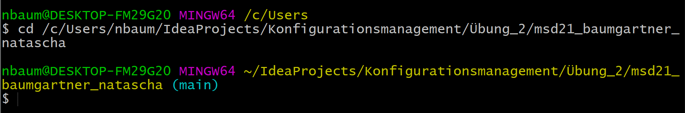
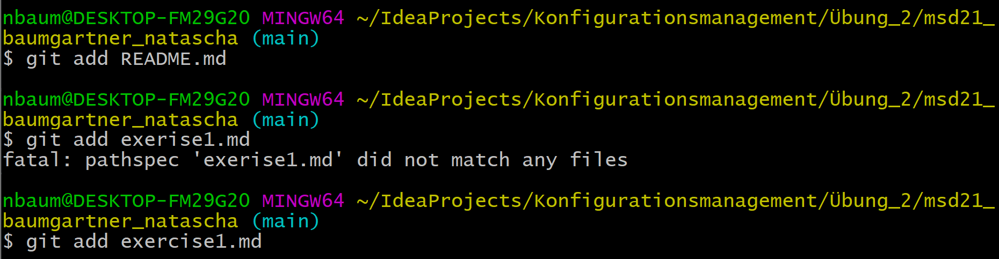
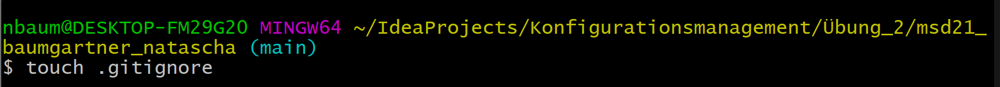
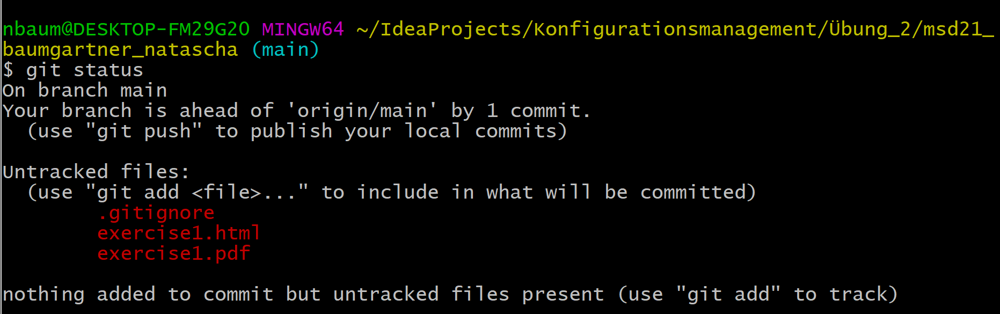
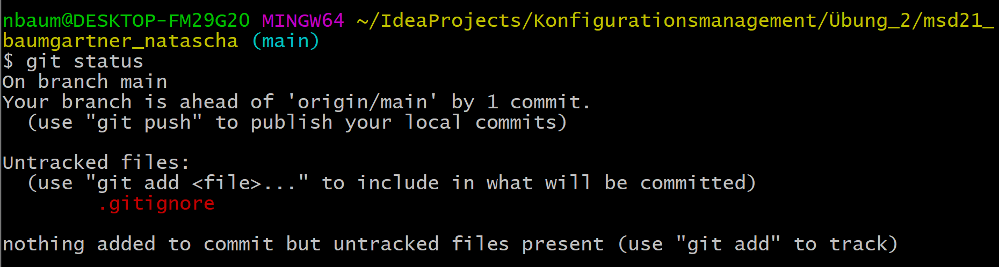
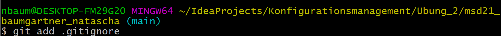
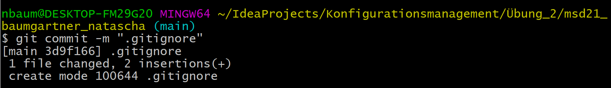

## git add .........
Selects your file and move it to the staging area.

## git commit -m "..........."
You need git commit -m after you used git add, then you can see all changes from the project

# How to use git add and git commit

1. Open Git Bash.

2. Go to your root.
    

3. Use git add for the markdown documents.
    

4. Use git commit -m "........" for the markdown documents.
    

5. Create the document .gitignore.
   

6. Ask for the git status.
    

7. Write in the .gitignore document, what you want to ignore. In my case I want to ignore html and pdf documents.
    

8. Ask again about the git status and you can see, that the html-document and the pdf-document is not there anymore.
    
   
9.  Use git add to add the .gitignore document
    

10. Use git commit -m "........" to finish the process.
    

