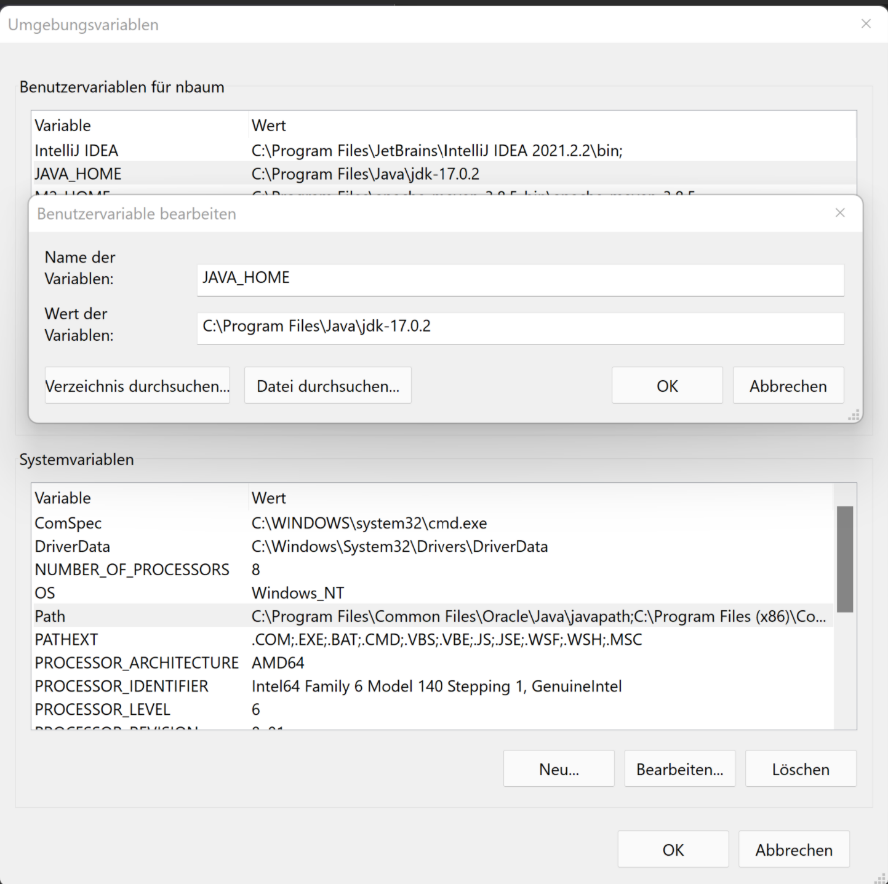
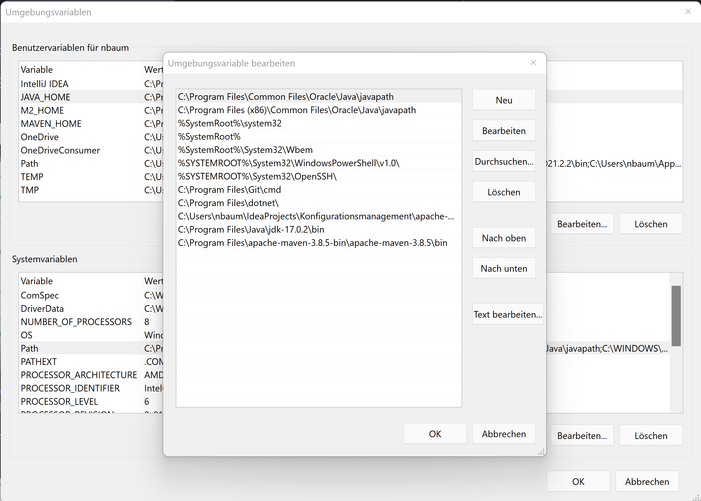
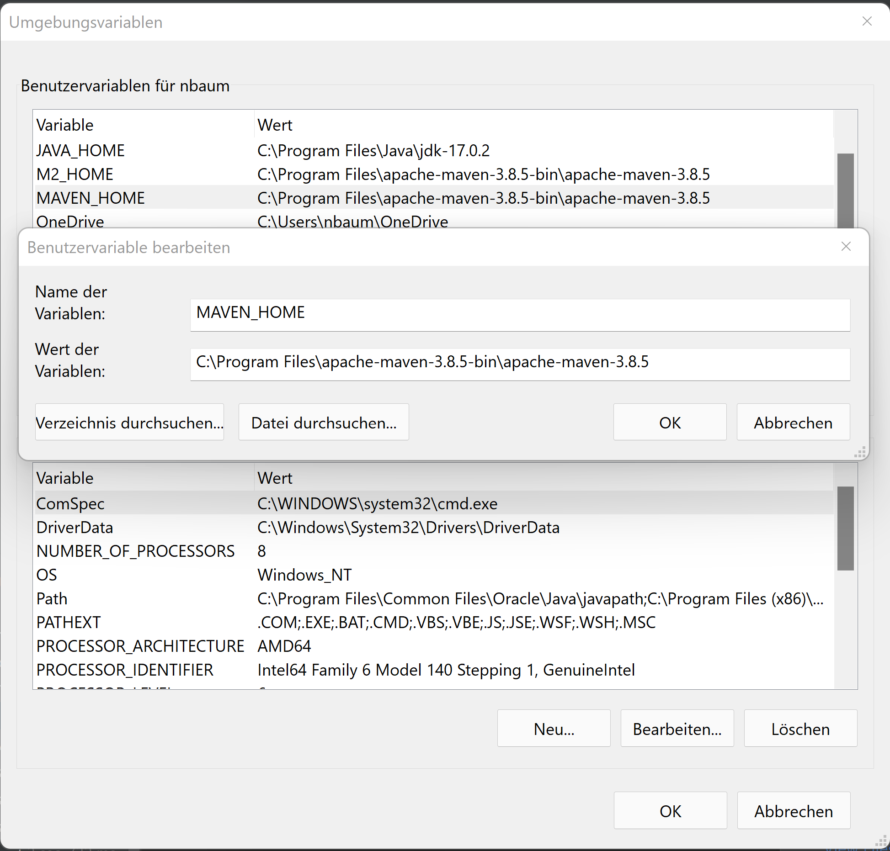
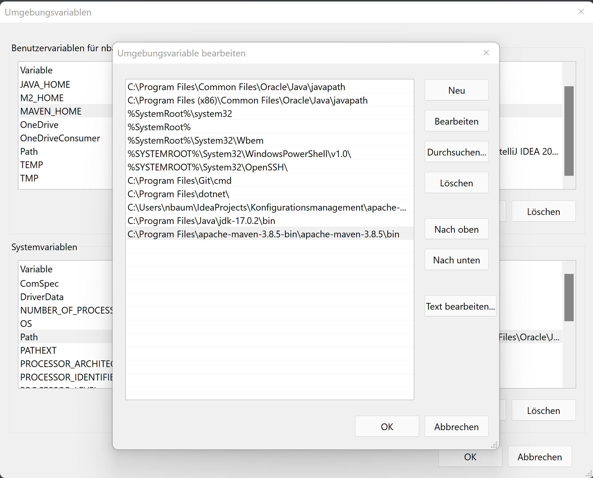
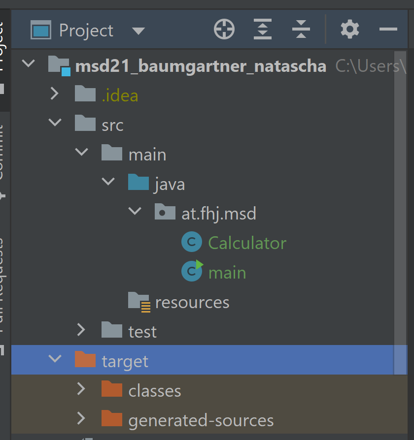
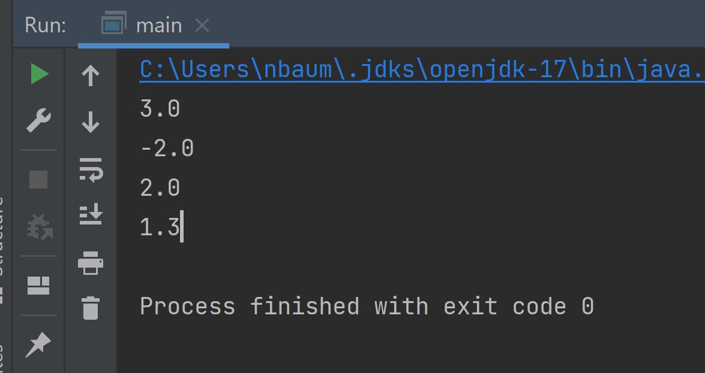

## How to install MAVEN

1. Check in cmd if you have java installed

`java -version`

2. If you haven't - click here to download [JAVA](https://www.oracle.com/java/technologies/downloads/)

3. After download JAVA set the environment variable for:

* JAVA_HOME (Path without ...\bin)

* JAVA Path (Path with ...\bin)

4. Check again in cmd if your installation was successful

`java -version`
`javac -version`

5. Click here for the [Maven-Website](https://maven.apache.org/download.cgi) and download the:

`Binary zip archive`

6. After download Maven set the environment variable for:
* MAVEN_HOME (Path without ...\bin)
  
* MAVEN Path (Path with ...\bin)
  

7. Check in cmd if your installation was successful

`mvn -v`

8. Create a new project in IntelliJ with Maven

9. Use your Repository-"Location"

10. Create a new Java-Class Calculator and Main

11. After your first execution there is a new output folder **target**
    The target folder is when a project is build or packaged, all the content of the sources, resources and web files will be put inside of it, it will be used for construct the artifacts and for run tests.

12. The output to console from the main-class is following:

13. 

