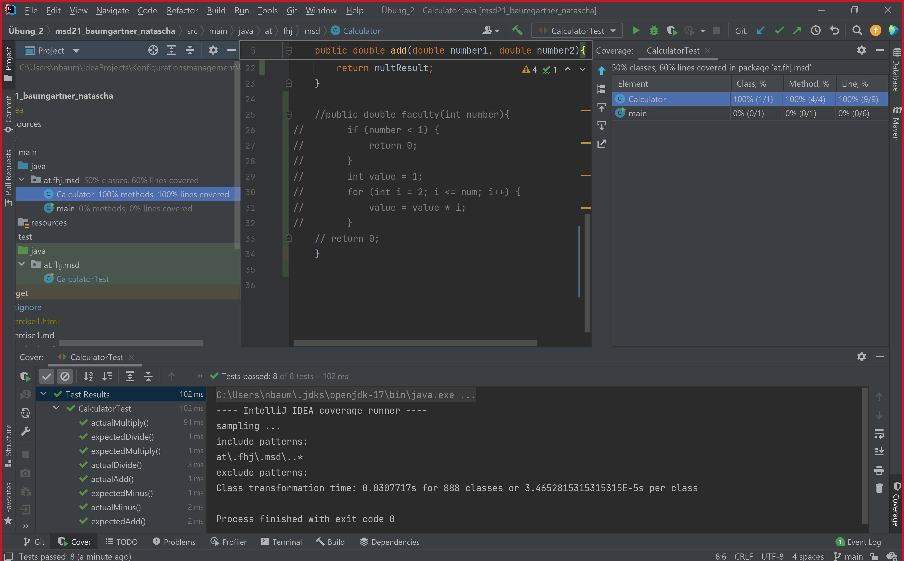

##Exercise 04: Source code testing

In this program you can test, if your methods will work.

## Installation

* IDE
* Console

## Usage

    @BeforeEach
    public void setup(){
    calc = new Calculator();
    }

    @Test
    public void expectedAdd(){
        Assertions.assertEquals(8, calc.add(5, 3));
    }

    @Test
    public void actualAdd(){
        Assertions.assertEquals(5+3, calc.add(5, 3));
    }

    @Test
    public void expectedMinus(){
    Assertions.assertEquals(2, calc.minus(5, 3));
    }

    @Test
    public void actualMinus(){
    Assertions.assertEquals(5-3, calc.minus(5, 3));
    }

    @Test
    public void expectedMultiply(){
        Assertions.assertEquals(15, calc.multiply(5, 3));
    }

    @Test
    public void actualMultiply(){
        Assertions.assertEquals(5*3, calc.multiply(5, 3));
    }

    @Test
    public void expectedDivide(){
        Assertions.assertEquals(2, calc.divide(4, 2));
    }

    @Test
    public void actualDivide(){
        Assertions.assertEquals(4/2, calc.divide(4, 2));
    }
    @Test
    public void expectedFaculty1(){
        Assertions.assertEquals(120, calc.faculty(5));
    }

    @Test
    public void expectedFaculty2(){
        Assertions.assertEquals(1*2*3*4*5, calc.faculty(5));
    }

    @Test
    public void expectedFaculty3(){
        Assertions.assertEquals(0, calc.faculty(-5));
    }

## Contributing

Pull requests are welcome. For major changes, please open an issue first to discuss what you would like to change.

Please make sure to update tests as appropriate.

## License

Natascha Baumgartner - Konfigurationsmanagement SS2021

## Screenshots

Testcoverage:

Errors:

